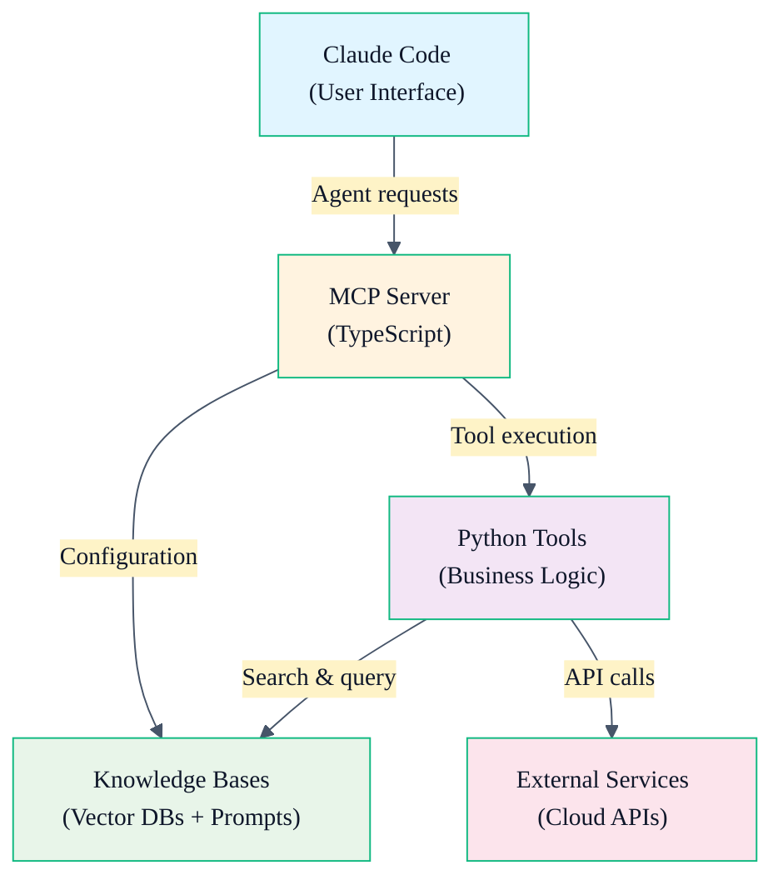
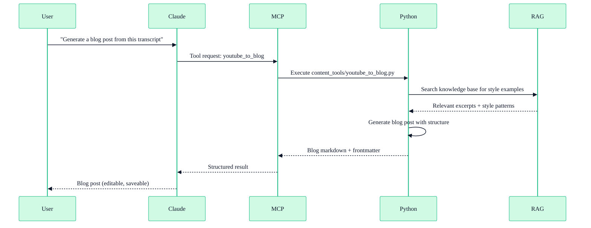

# Architecture & Components

> Source: `README.md` + repo structure

The framework is organized in 5 architectural layers: Claude Code (user interface), MCP server (tool orchestration), Python tools (business logic), knowledge bases (data), and external services (cloud integrations).

## System Layers



## Layer Details

### Layer 1: Claude Code (User Interface)

The interactive shell where you type commands and ask Claude to generate content. Claude Code reads and executes:

- `.claude/agents/*.md` — Task-specific agent definitions
- `.claude/skills/*.md` — Quick-action skill definitions  
- `.claude/rules/*.md` — Content style, coding conventions, brand voice
- `config/agent_profile.yaml` — Personal information and template variables

No code execution happens here — this is pure language interaction.

### Layer 2: MCP Server (TypeScript Orchestration)

`mcp_server/src/index.ts` — The bridge between Claude Code and your tools. The MCP server:

- Exposes 17 built-in tools as MCP resources
- Receives tool invocation requests from Claude Code
- Routes requests to Python scripts in `tools/`
- Returns structured results (JSON, CSV, markdown)
- Manages error handling and logging

Built with TypeScript, compiled to JavaScript, runs via `node mcp_server/dist/index.js`.

### Layer 3: Python Tools (Business Logic)

Organized by function:

| Directory | Purpose |
|-----------|---------|
| `tools/rag_tools/` | Vector database creation, semantic search, knowledge base operations |
| `tools/youtube_tools/` | YouTube transcript download, metadata extraction, channel analysis |
| `tools/content_tools/` | Blog post generation, email sequences, social clip scripting |
| `tools/csv_tools/` | Contact list import, data standardization, duplicate detection |
| `tools/guide_tools/` | Relocation guide generation, format conversion (Markdown → Word/PDF) |
| `tools/crm_tools/` | GoHighLevel REST client, contact/pipeline operations |

Each subdirectory contains standalone scripts, not a monolithic package. Scripts use:
- **chromadb** for vector storage
- **sentence-transformers** for embeddings
- **yt-dlp** for YouTube operations
- **requests** for API calls
- **python-dotenv** for credential management

### Layer 4: Knowledge Bases (Data)

Located in `knowledge_bases/`:

| Directory | Contents |
|-----------|----------|
| `vectors/` | Searchable databases (auto-created by ingestion scripts) |
| `books/` | Pre-loaded marketing frameworks (Hormozi, Brunson, Channel Junkies) as vector DBs |
| `documents/` | Your PDFs, Word docs, text files — dropped here for indexing |
| `prompts/` | Prompt templates for content generation (e.g., YouTube outline prompt) |

Knowledge bases use **ChromaDB** for local vector storage + **sentence-transformers** for embeddings. All processing happens locally; nothing leaves your computer.

### Layer 5: External Services (Cloud APIs)

Optional integrations:

- **GoHighLevel** — CRM contact/pipeline management (via REST API, needs `CRM_API_KEY`)
- **Hostinger** — Domain/DNS/hosting management (via MCP server, needs `API_TOKEN`)
- **Supabase** — Cloud database for storing leads or analytics (via HTTP MCP, optional)
- **Gmail & Google Calendar** — Email and scheduling (via Claude.ai integrations, requires Pro/Max plan)
- **Vercel** — Website deployment (via Claude.ai integrations, requires Pro/Max plan)
- **YouTube** — Public transcript download (no API key needed; read-only)

## Data Flow Example: Generate Blog from Transcript



## Configuration Files

| File | Purpose |
|------|---------|
| `config/agent_profile.yaml` | Your personal info (name, phone, market, etc.) — defines template variables |
| `config/channels.yaml` | List of YouTube channels to ingest for knowledge base |
| `config/.env` | API keys (CRM_API_KEY, ANTHROPIC_API_KEY, etc.) — never committed |
| `~/.mcp.json` | MCP server configuration (Claude Code integration) |

## Build & Deploy Flow

```
npm install              # Install Node dependencies
npm run build            # Compile TypeScript → JavaScript
python -m pip install -r requirements.txt  # Install Python dependencies
bash scripts/setup.sh    # One-time: build knowledge base, configure agents
```

After setup, everything is available immediately when you start a Claude Code session.

## Related Topics

- [Framework Overview](/framework/overview)
- [Repository Layout](/framework/repo-layout)
- [Design Principles](/framework/principles)
