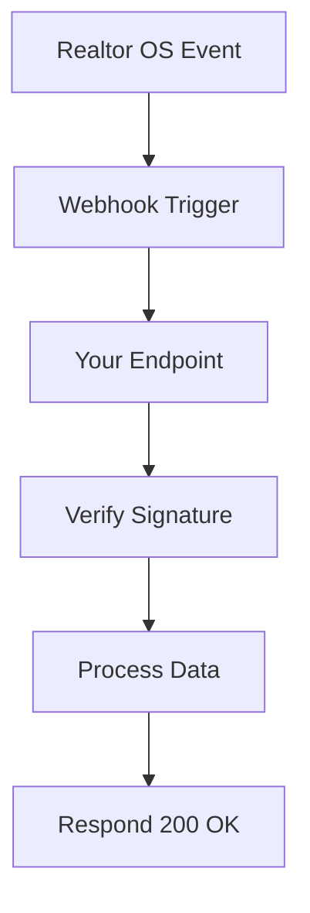

## Overview

Realtor OS supports seamless integrations with popular real estate tools, CRMs, and automation platforms. You can connect MLS feeds, CRM systems, and notification services to streamline your workflows. This guide covers setup, popular connections, webhooks, data handling, and security best practices.

<Callout kind="info">
  All integrations require your Realtor OS API key. Generate one from your dashboard at `https://dashboard.example.com/settings/api`.
</Callout>

## Popular Integrations

Discover ready-to-use connections for common real estate services.

<Columns cols={3}>
  <Card title="MLS APIs" icon="database" href="https://mls.example.com/docs">
    Sync property listings from major MLS providers like RETS or RESO Web API.
  </Card>
  <Card title="CRM Sync" icon="users" href="https://crm.example.com/integrations">
    Integrate with Salesforce or HubSpot to manage leads and deals automatically.
  </Card>
  <Card title="Zapier" icon="zap" href="https://zapier.com/apps/realtoros">
    Build no-code automations with 5000+ apps using Zapier triggers and actions.
  </Card>
  <Card title="Google Workspace" icon="mail" href="https://workspace.google.com/marketplace">
    Automate email campaigns and calendar syncing for client communications.
  </Card>
  <Card title="QuickBooks" icon="dollar-sign" href="https://quickbooks.intuit.com/app/apps/appdetails/realtoros">
    Handle invoicing and commission tracking directly from deals.
  </Card>
  <Card title="DocuSign" icon="file-text" href="https://docusign.com/integrations">
    Streamline contract signing and document workflows.
  </Card>
</Columns>

## Setting Up an Integration

Follow these steps to connect a third-party service.

<Steps>
  <Step title="Generate API Credentials" icon="key">
    Log in to your Realtor OS dashboard. Navigate to **Settings > API Keys** and create a new key with `integrations:write` scope.
  </Step>
  <Step title="Configure External Service" icon="settings">
    In your third-party app (e.g., Zapier), add `https://api.example.com/v1/integrations` as the base URL.
  </Step>
  <Step title="Test Connection" icon="check-circle">
    Send a test request:

````javascript
const response = await fetch('https://api.example.com/v1/integrations/ping', {
  headers: {
    'Authorization': `Bearer YOUR_API_KEY`,
    'Content-Type': 'application/json'
  }
});
````

  </Step>
  <Step title="Enable Sync" icon="play">
    Toggle the integration live in both Realtor OS and the external service dashboards.
  </Step>
</Steps>

## Webhook Configuration

Set up webhooks to receive real-time notifications for events like new leads or property updates.

<Tabs>
  <Tab title="Outgoing Webhooks (Realtor OS → Your App)" icon="arrow-right">
    Configure in dashboard: **Settings > Webhooks > Add Endpoint**.

    <Request tabs="cURL,JavaScript" show-lines="true">
````curl
curl -X POST https://your-webhook-url.com/lead \
  -H "Content-Type: application/json" \
  -d '{
    "event": "lead.created",
    "data": {
      "name": "John Doe",
      "email": "john@example.com",
      "propertyId": "prop-123"
    }
  }'
````

````javascript
// Example payload handler
app.post('/webhook', (req, res) => {
  const { event, data } = req.body;
  if (event === 'lead.created') {
    // Process new lead
    console.log(data.name);
  }
  res.status(200).send('OK');
});
````
    </Request>
  </Tab>
  <Tab title="Incoming Webhooks (Your App → Realtor OS)" icon="arrow-left">
    Use this endpoint: `POST https://api.example.com/v1/webhooks`.

    <ParamField header="Authorization" param-type="string" required="true">
      Bearer token from your API key.
    </ParamField>

    <ParamField body="event" param-type="string" required="true">
      Event type, e.g., `property.updated`.
    </ParamField>

    <ParamField body="payload" param-type="object" required="true">
      Data object with relevant fields.
    </ParamField>
  </Tab>
</Tabs>

## Data Import and Export

Import listings or export reports using CSV or API.

<CodeGroup tabs="CSV Import,JSON Export">
````bash
# CSV Import via CLI
realtor-os import --file listings.csv --format csv
# Sample CSV header: id,title,price,status
````

````javascript
// JSON Export example
const fs = require('fs');
const response = await fetch('https://api.example.com/v1/listings/export?format=json', {
  headers: { 'Authorization': `Bearer YOUR_API_KEY` }
});
const data = await response.json();
fs.writeFileSync('listings.json', JSON.stringify(data, null, 2));
````
</CodeGroup>

## Security Considerations

Protect your integrations with these practices.

<Callout kind="alert">
  Never expose API keys in client-side code or public repositories. Use environment variables like `process.env.REALTOR_OS_API_KEY`.
</Callout>

<Expandable title="Advanced Security Options" default-open="false">
  Enable IP whitelisting in **Settings > Integrations > Security**. Rotate keys every 90 days. Use webhook signatures for verification:

````javascript
// Verify signature
const crypto = require('crypto');
const signature = crypto.createHmac('sha256', 'YOUR_WEBHOOK_SECRET')
  .update(payload)
  .digest('hex');
if (signature !== req.headers['x-signature']) {
  throw new Error('Invalid signature');
}
````
</Expandable>



Ready to integrate? Check [Quickstart](/quickstart) for basics or explore [Authentication](/authentication) for secure API access.