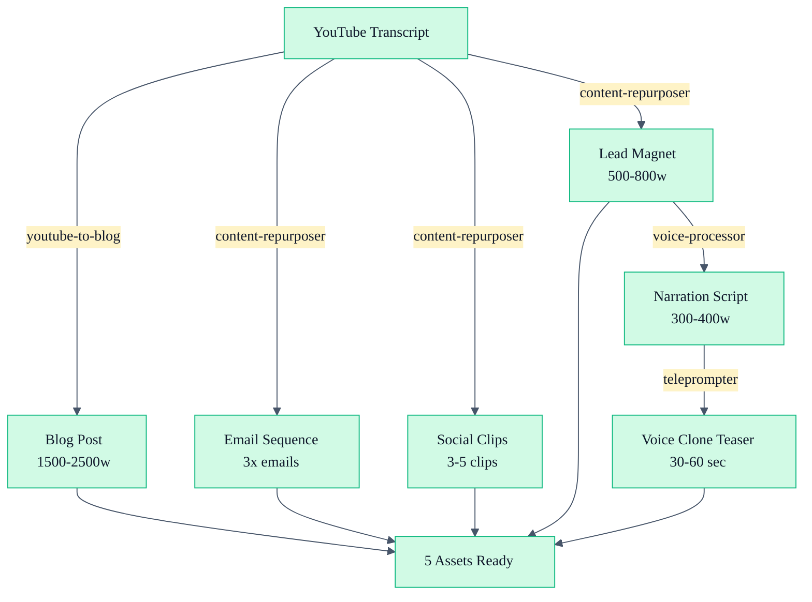

# Video-to-5-Assets Pipeline

Transform a single YouTube video into five distinct marketing assets in one orchestrated workflow. Perfect for scaling content production without multiplying creation effort.

## Overview

This workflow chains three agents in sequence to produce:
1. **Blog post** (1500-2500 words, SEO-optimized)
2. **Email sequence** (3 nurture emails using Daily Seinfeld framework)
3. **Social clips** (3-5 platform-native videos)
4. **Lead magnet excerpt** (500-800 word downloadable guide)
5. **Voice clone teaser** (30-60 second AI-voiced preview)

## Inputs

- YouTube video URL or transcript
- Video title, video ID, and target keywords
- Optional: Internal links to include, brand guidelines

## Outputs

| Format | Length | Use | Platform |
|--------|--------|-----|----------|
| Blog Post | 1500-2500 words | Organic search + owned media | Website |
| Email #1 | ~150 words | Day 0: Hook + intro | Email |
| Email #2 | ~150 words | Day 2: Deeper value | Email |
| Email #3 | ~150 words | Day 5: CTA + booking | Email |
| Social Clip 1 | 30-90 sec | Hook moment | YouTube Shorts / TikTok |
| Social Clip 2 | 30-90 sec | Main insight | Instagram Reels |
| Social Clip 3 | 30-90 sec | Surprising stat | Facebook |
| Lead Magnet | 500-800 words | Conversion tool | PDF / Email upgrade |
| Voice Teaser | 30-60 sec | Awareness + trust | YouTube Shorts / Email |

## Pipeline (Step-by-Step)

### Step 1: YouTube-to-Blog (youtube-to-blog agent)

**Input:** Raw transcript or cleaned video transcript
**Process:**
1. Analyze speaker voice, patterns, and expertise signals
2. Research and verify claims with external sources
3. Write 1500-2500 word blog post with: intro, H2 sections, FAQ, CTA
4. Embed video, add internal/external links, optimize for SEO
5. Generate meta description (150-160 chars) and URL slug

**Output:** Blog post ready for WordPress publish

**Time:** ~45-60 min

---

### Step 2: Content-to-Repurposer (content-repurposer agent)

**Input:** Cleaned transcript or blog post
**Process:**
1. Identify 3-5 strongest standalone moments (insights, stories, data points)
2. Extract quotes and key phrases for social usage
3. Generate 3 email sequence using Story-Hook-Value-Invite structure
4. Create 3-5 social clips with platform-specific captions and hashtags
5. Pull 500-800 words for lead magnet formatting

**Output:** 
- 3 ready-to-send emails
- 5 clip specifications (timestamps + captions)
- Lead magnet excerpt in plain text

**Time:** ~40-50 min

---

### Step 3: Voice-Processor + Teleprompter (voice-processor & teleprompter agents)

**Input:** Extracted lead magnet text or blog excerpt
**Process:**
1. Clean text for voice narration (remove links, shorten paragraphs)
2. Generate teleprompter script with delivery cues
3. Prepare for voice cloning service (ElevenLabs, Descript, or similar)
4. Add credibility line and soft CTA

**Output:** 
- Cleaned narration script (300-400 words)
- Voice cloning specifications (speaker tone, pacing)
- Teaser script with video direction cues

**Time:** ~20-30 min

---

## Mermaid Workflow Diagram



## Example Invocation

```bash
# 1. Start with transcript
ck run agent youtube-to-blog \
  --transcript "{{raw_transcript}}" \
  --title "Why Most Relocators Make This Costly Mistake" \
  --video-id "abc123xyz" \
  --target-keywords "Austin relocation tips, moving mistakes"

# 2. Repurpose the output
ck run agent content-repurposer \
  --source "blog-post.md" \
  --formats email,social-clips,lead-magnet

# 3. Create voice teaser
ck run agent voice-processor \
  --input "lead-magnet-excerpt.txt" \
  --output-type teaser \
  --voice-style "warm-conversational"
```

## Cross-References

- [YouTube-to-Blog Agent](/agent-instructions/youtube-to-blog) — Blog creation engine
- [Content Repurposer Agent](/agent-instructions/content-repurposer) — Multi-format extraction
- [Email Writer Agent](/agent-instructions/email-writer) — Nurture email framework
- [Voice Processor Agent](/agent-instructions/voice-processor) — Voice narration prep
- [Teleprompter Agent](/agent-instructions/teleprompter) — Delivery script generation

## Implementation Notes

- **Timing:** Full pipeline takes 2-3 hours with manual review between steps
- **Sequence:** Always run youtube-to-blog first; other agents work in parallel
- **Quality gates:** Review blog post before starting repurposing — agent tone must match
- **Voice cloning:** Services like ElevenLabs typically process in 5-15 minutes after script approval
- **Distribution timing:** Space emails 2-5 days apart; publish blog 24 hours before first email

## Related Links

- [Video Pipeline Phases](/agent-instructions/youtube-video-pipeline)
- [Content Multiplier Strategy](/workflows/content-multiplier)
