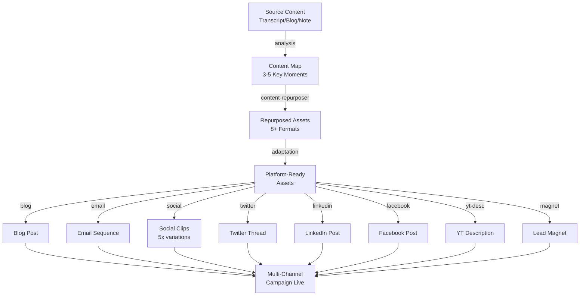

# Content Multiplier Workflow

One piece of source content → N platform-native variants. Maximize reach and audience engagement by adapting proven content to each platform's native format and audience behavior.

## Overview

This workflow uses the content-repurposer agent to:
1. Extract core insights from source material
2. Generate platform-specific variations
3. Adapt formatting, tone, and CTA for each channel
4. Maintain voice consistency across variants
5. Deliver ready-to-publish assets

## Inputs

| Source Type | Example | Best For |
|-------------|---------|----------|
| YouTube transcript | Full 10-15 min video | Comprehensive source material |
| Blog post | 1500-2500 word article | SEO-rich insights |
| Voice note | Dictation or recording | Quick idea capture |
| Market report | Data file or PDF | Educational content |
| Email | Existing nurture email | Social repurposing |

## Outputs

| Platform | Format | Length | Quantity |
|----------|--------|--------|----------|
| Blog | Markdown with frontmatter | 1500-2500 words | 1 |
| Email | Plain text sequence | 3 x 150-200 words | 3 |
| YouTube Shorts | Script + captions | 30-90 sec | 3-5 clips |
| Instagram Reels | Script + hashtags | 30-90 sec | 2-3 clips |
| TikTok | Hook-first format | 30-60 sec | 2-3 clips |
| Twitter/X | Thread format | 280 char posts | 1 thread (5-10 posts) |
| LinkedIn | Professional narrative | 300-500 words | 1 post |
| Facebook | Community-focused | 200-400 words | 1 post |
| YouTube Description | Hook + timestamps | 200-300 words | 1 |
| Lead Magnet | Standalone excerpt | 500-800 words | 1 |

## Pipeline (Step-by-Step)

### Step 1: Source Analysis

**Input:** Raw content (transcript, blog, or notes)

**Process:**
1. Identify 3-5 strongest moments (insights, stories, stats, quotes)
2. Extract key data points and memorable phrases
3. Map moments to platform strengths:
   - **Visual insight?** → YouTube Shorts, Instagram Reels
   - **Surprising stat?** → Twitter, LinkedIn
   - **Personal story?** → Email, Facebook, LinkedIn
   - **Actionable tip?** → Blog, lead magnet
4. Note voice/tone markers from source
5. Extract CTAs and offers mentioned

**Output:**
- Content map document
- 3-5 extracted moments with platform recommendations

**Time:** ~15-20 min

---

### Step 2: Content Repurposing (content-repurposer agent)

**Input:** Source material + content map

**Process:**
1. Generate blog post with full structure and SEO optimization
2. Create email sequence using Story-Hook-Value-Invite framework
3. Extract social clips with platform-specific captions
4. Write Twitter/X thread with engagement hooks
5. Compose LinkedIn post with professional framing
6. Create Facebook post with community angle
7. Pull lead magnet excerpt with formatting
8. Write YouTube description with timestamps

**Output:**
- 8+ ready-to-publish assets
- All with proper formatting, hashtags, and CTAs
- 2-3 options per format for agent selection

**Time:** ~50-75 min

---

### Step 3: Platform-Specific Adaptation

**Input:** Raw repurposed content from agent

**Process:**
1. **Blog post:** Add featured image suggestions, internal links, schema markup
2. **Emails:** Verify subject lines, add preview text, check plaintext rendering
3. **Social clips:** Confirm timestamps match transcript, verify hook strength
4. **Twitter thread:** Test character counts, optimize reply structure
5. **LinkedIn:** Add formatting (line breaks), professional tone check
6. **Facebook:** Confirm casual tone, add engagement question
7. **YouTube:** Insert exact video ID, verify timestamps
8. **Lead magnet:** Format for PDF or one-pager, add brand elements

**Output:**
- Platform-ready assets (no further editing needed)
- Publishing checklist with deadlines

**Time:** ~30-45 min

---

### Step 4: Publishing & Distribution

**Input:** All platform-ready assets

**Process:**
1. **Blog:** Schedule publication for peak traffic day (often Tuesday-Thursday)
2. **Email:** Schedule sequence for: Day 0 (blog publish), Day 2, Day 5
3. **Social clips:** Schedule across 7-14 day window (not all same day)
4. **Twitter thread:** Publish threads on business hours, weekday mornings
5. **LinkedIn:** Schedule for Tuesday-Thursday, 8-10 AM
6. **Facebook:** Mix weekday and weekend, test posting times
7. **YouTube description:** Update upon video publish
8. **Lead magnet:** Gate on landing page or in email footer

**Output:**
- All assets published or scheduled
- Distribution calendar with posting schedule

**Time:** ~20-30 min

---

## Mermaid Workflow



## Example Invocation

```bash
# 1. Analyze source
ck run agent content-repurposer \
  --input "video-transcript.txt" \
  --analyze-only true \
  --output "content-map.md"

# 2. Repurpose to all formats
ck run agent content-repurposer \
  --input "video-transcript.txt" \
  --formats "blog,email,social-clips,twitter,linkedin,facebook" \
  --output "repurposed-assets/" \
  --options-per-format 2

# 3. Publish to WordPress blog
wp post create --post_title="Blog Title" \
  --post_content="$(cat repurposed-assets/blog.md)" \
  --post_status="publish"

# 4. Schedule emails
mailchimp campaign create \
  --list-id="nurture" \
  --template="$(cat repurposed-assets/email-1.txt)"
```

## Voice Consistency Checklist

Across all 8+ variants, verify:

- [ ] **Same perspective:** If agent says "I believe X" in video, all variants reflect that opinion
- [ ] **Data consistency:** Same numbers, same sources — no rounded differently between platforms
- [ ] **Vocabulary match:** Platform adaptation, not rewriting
- [ ] **Personality preservation:** Humor stays humorous, serious stays serious
- [ ] **CTA alignment:** Each platform's CTA leads to appropriate next step

## Distribution Calendar Template

| Format | Day | Time | Cadence | Notes |
|--------|-----|------|---------|-------|
| Blog | Tue | 9 AM | 1x | Triggers email sequence |
| Email #1 | Tue | 2 PM | 1x | Sent day of blog publish |
| Social Clip 1 | Wed | 10 AM | 1x | YouTube Shorts + TikTok |
| Twitter Thread | Wed | 8 AM | 1x | Link to blog |
| Email #2 | Thu | 2 PM | 1x | Follow-up value |
| Social Clip 2 | Fri | 10 AM | 1x | Instagram Reels + TikTok |
| LinkedIn Post | Mon | 9 AM | 1x | Same week, peak engagement |
| Facebook Post | Sat | 3 PM | 1x | Weekend casual audience |
| Email #3 | Sun | 10 AM | 1x | Final CTA + booking link |

## Success Metrics

| Metric | Target | Channel |
|--------|--------|---------|
| Blog views | 500+ | Website |
| Email open rate | 25%+ | Email |
| Social engagement rate | 3%+ | Social media |
| Click-through rate | 5%+ | All links |
| Lead captures | 10-20 | All CTA links |
| Conversion to call | 3-5% | All channels |

## Cross-References

- [Content Repurposer Agent](/agent-instructions/content-repurposer) — Multi-format extraction engine
- [Email Writer Agent](/agent-instructions/email-writer) — Nurture email framework
- [YouTube-to-Blog Agent](/agent-instructions/youtube-to-blog) — Blog post generation
- [Video-to-5-Assets Pipeline](/workflows/1-video-5-assets) — Simplified version focused on blog + email + social

## Best Practices

- **One source, many variants:** Minimum 5-8 formats per source for ROI
- **Spacing:** Spread publishing over 7-14 days to avoid audience fatigue
- **Test variants:** For social clips, test 2-3 hook variations and measure engagement
- **Mobile-first:** All clips and posts should be readable on mobile
- **Link strategy:** Blog is hub; all social/email link back to blog with tracking params
- **Repurposing depth:** Don't just copy-paste across platforms; adapt to each channel's UX

## Related Links

- [Content Repurposer Agent](/agent-instructions/content-repurposer)
- [Video-to-5-Assets Pipeline](/workflows/1-video-5-assets)
- [Email Writer Agent](/agent-instructions/email-writer)
