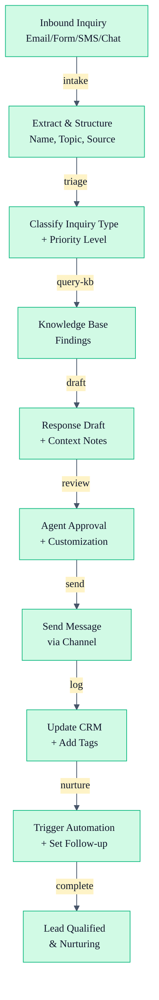

# Customer Response Flow

Systematically capture, classify, and respond to inbound customer inquiries while maintaining personal voice and accuracy.

## Overview

This workflow orchestrates the customer-response agent with CRM integration to:
1. Receive inquiry (email, form, message)
2. Extract and classify inquiry type
3. Query knowledge bases for context
4. Draft personalized response
5. Log interaction and update CRM
6. Nurture lead appropriately

## Inputs

| Channel | Source | Priority Signal |
|---------|--------|-----------------|
| Email | info@domain.com | Subject line |
| Website form | Landing page | Form response |
| SMS | Phone number | Message content |
| Facebook Messenger | Facebook page | Timestamp |
| YouTube comment | Video comment | Video URL |
| Instagram DM | Instagram profile | Direct message |
| Referral | Phone call | Referred by name |

## Outputs

| Output | Purpose | Recipient |
|--------|---------|-----------|
| Response draft | Ready-to-send message | Agent for review |
| CRM entry | Contact capture | CRM system |
| Tag assignment | Segmentation & automation | CRM contact |
| Follow-up reminder | Nurture timing | Agent calendar |
| Lead score | Pipeline priority | CRM & agent |

## Pipeline (Step-by-Step)

### Step 1: Intake & Extraction

**Input:** Inbound message from any channel

**Process:**
1. Capture message content, timestamp, and source channel
2. Extract sender name, contact info (email/phone/handle)
3. Identify inquiry topic/keywords
4. Flag urgency signals ("ASAP," "today," "emergency," etc.)
5. Note any previous interaction context

**Output:**
- Structured inquiry data
- Lead contact record

**Time:** ~1-2 min (mostly automated)

---

### Step 2: Triage & Classification (customer-response agent)

**Input:** Extracted inquiry data

**Process:**
1. Classify inquiry type:
   - Hot buyer (ready to move/tour within 30 days)
   - Warm buyer (researching, 1-6 months out)
   - Cold buyer (exploring, no timeline)
   - Seller inquiry (considering selling)
   - Objection (pushing back on advice/area)
   - Referral (warm introduction)
   - General question (area info, process)

2. Determine response priority:
   - **Immediate (15 min):** Hot buyers, referrals, hot sellers
   - **Same day (2-4 hours):** Warm buyers, seller inquiries
   - **24 hours:** Cold buyers, general questions

3. Query knowledge bases:
   - Conversation history RAG (previous interactions with contact)
   - Neighborhood knowledge base (area-specific info)
   - Market data knowledge base (current conditions)
   - Agent's content RAG (how agent has discussed topic before)

**Output:**
- Inquiry classification + priority level
- Knowledge base findings
- Suggested response template

**Time:** ~5-10 min

---

### Step 3: Response Drafting (customer-response agent)

**Input:** Classified inquiry + knowledge base findings

**Process:**
1. Analyze agent's communication style from previous messages
2. Match response template to inquiry type
3. Populate with knowledge base findings + agent perspective
4. Ensure direct answer to actual question (not pivot to sales)
5. Add appropriate CTA for inquiry temperature
6. Keep length proportional to question (short Q = short A)

**Output:**
- Response draft with context notes
- Data sources cited for fact-checking
- Suggestions for agent customization

**Time:** ~10-15 min

---

### Step 4: Review & Customization

**Input:** Response draft

**Process:**
1. Agent reviews draft for accuracy and tone
2. Make any personal additions or context
3. Verify all data points are current
4. Adjust CTA if needed (calendar link, specific offer, etc.)
5. Approve or request rewrites

**Output:**
- Final response, agent-approved

**Time:** ~3-5 min

---

### Step 5: Send & Log (CRM agent)

**Input:** Approved response + contact record

**Process:**
1. Send message via appropriate channel (email, SMS, etc.)
2. Log interaction in CRM with full context
3. Add/update contact record with new information
4. Assign tags based on inquiry type and response
5. Set follow-up reminder based on priority
6. Update pipeline stage if applicable

**Output:**
- Message sent
- CRM entry created/updated
- Follow-up scheduled

**Time:** ~2-3 min

---

### Step 6: Nurture Automation

**Input:** Contact tags + inquiry type

**Process:**
1. Trigger automated nurture sequence if applicable:
   - **Hot buyer:** Daily check-in sequence, property alerts, calendar invites
   - **Warm buyer:** 2x/week nurture emails, market updates, helpful resources
   - **Cold buyer:** 1x/week content emails, relocation guide, educational series
   - **Seller:** Seller education sequence, CMA offer, closing process guide
2. Set follow-up reminder to agent (if human follow-up needed)
3. Add contact to appropriate email list

**Output:**
- Nurture sequence triggered
- Follow-up reminder set
- Email list updated

**Time:** ~1-2 min (automated)

---

## Mermaid Workflow



## Inquiry Type Examples

### Hot Buyer
```
Input:  "Hi, we're moving to Austin next month and want to start 
         looking at homes this week. Can we schedule a tour?"

Output: Direct acknowledgment of urgency
        Specific next step (booking link)
        Property suggestions or recent listings
        Personal value-add (neighborhood insight, market intel)
        Clear CTA with calendar link
```

### Warm Buyer
```
Input:  "What neighborhoods in Austin are good for families 
        with kids? We're thinking about moving in 6 months."

Output: Direct answer to question with specific neighborhoods
        One layer of insight they didn't ask for (school comparison, 
        lifestyle angle)
        Timeline-relevant next step ("when you're ready, I'm here")
        Soft offer (guide download, video link)
```

### Seller Inquiry
```
Input:  "I'm thinking about selling my home. What's the market 
        like right now?"

Output: Acknowledge interest in selling
        One relevant market insight for their area
        Clear next step (CMA consultation, market analysis)
        Brief mention of agent's approach
```

### Objection
```
Input:  "Isn't Austin too hot/expensive/crowded for families?"

Output: Validate the concern (don't dismiss)
        Reframe with data or personal experience
        Client story (anonymized) if applicable
        Honest assessment
        Path forward
```

## Response Template Examples

### Template: Hot Buyer

```
[Greeting matching agent style]

[Direct acknowledgment of urgency + excitement]
[Specific next step — booking a call, sending properties, scheduling tour]
[One piece of valuable info showing expertise]
[Clear CTA with booking link or phone number]

[Agent sign-off]
```

### Template: Objection Handling

```
[Greeting]

[Acknowledge concern — validate, don't dismiss]
[Reframe with data or personal experience]
[Share relevant client story (anonymized) if applicable]
[Honest assessment — if the concern is valid, say so]
[Path forward addressing the objection]

[Sign-off]
```

## Example Invocation

```bash
# 1. Receive inquiry and extract
ck run agent customer-response \
  --inquiry "Hi, I'm thinking about moving to Austin. Any tips?" \
  --source "website-form" \
  --contact-name "Jane Smith" \
  --contact-email "jane@example.com"

# 2. Triage and draft response
ck run agent customer-response \
  --action "classify-and-draft" \
  --inquiry-id "inbound-001"

# 3. Send and log in CRM
ck run agent crm-agent \
  --action "create-contact" \
  --name "Jane Smith" \
  --email "jane@example.com" \
  --source "website-form" \
  --tags "cold-buyer,austin-interested"

# 4. Trigger nurture
ck trigger automation \
  --contact-id "jane-smith-123" \
  --sequence "cold-buyer-nurture"
```

## SLA (Service Level Agreement)

| Inquiry Type | Response Time | Response Channel |
|--------------|---------------|------------------|
| Hot buyer | 15 minutes | Phone call preferred |
| Warm buyer | 2-4 hours | Email |
| Seller inquiry | Same day | Email or call |
| Referral | 15 minutes | Phone call |
| General question | 24 hours | Email |
| Objection | 24-48 hours | Email (thoughtful) |

## Quality Checklist

- [ ] Response directly answers the customer's actual question
- [ ] Voice and tone match agent's communication style
- [ ] All facts verified from knowledge bases or CRM
- [ ] No Fair Housing violations
- [ ] No generic realtor language
- [ ] CTA is appropriate for inquiry type and temperature
- [ ] Response length proportional to question
- [ ] Market data includes timeframe reference
- [ ] No unauthorized commitments
- [ ] CRM contact record created/updated
- [ ] Appropriate tags assigned for segmentation

## Cross-References

- [Customer Response Agent](/agent-instructions/customer-response) — Core response drafting
- [CRM Agent](/agent-instructions/crm-agent) — Contact management & logging
- [Email Writer Agent](/agent-instructions/email-writer) — Nurture sequences

## Integration Points

- **CRM system:** Auto-capture contacts, log all interactions, trigger automations
- **Email provider:** Auto-responder sequences, list segmentation
- **Calendar system:** Agent availability for booking links
- **Knowledge bases:** RAG queries for content, market data, neighborhood info
- **Phone system:** Call logging, voicemail transcription

## Best Practices

- **Speed matters:** Hot buyers expect response within 15 minutes
- **Mobile-optimized:** Many inquiries come from mobile — keep responses scannable
- **One question per email:** If customer asks 3 things, number your answers
- **Data freshness:** Quarterly knowledge base updates for market data
- **Conversation continuity:** Always reference previous interactions if available
- **Honest over perfect:** If you don't know, say so and offer to find out
- **Follow-up strategy:** If no response in 3 days, send one gentle re-engagement, then pause

## Related Links

- [Customer Response Agent](/agent-instructions/customer-response)
- [CRM Agent](/agent-instructions/crm-agent)
- [Email Writer Agent](/agent-instructions/email-writer)
