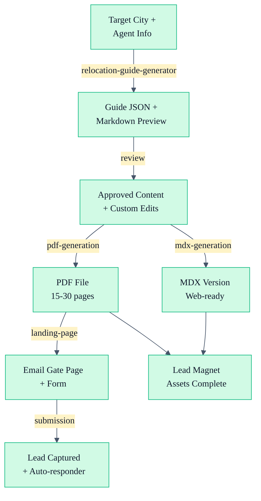

# Lead Magnet Generation Workflow

Transform agent expertise and video content into gated downloadable assets that capture leads and accelerate nurturing.

## Overview

This workflow creates comprehensive relocation guides and checklists designed to:
1. Capture email addresses from interested buyers
2. Provide genuine value (not just a brochure)
3. Establish agent as local expert
4. Enable triggered email sequences
5. Generate conversion data for optimization

## Inputs

- Target city/cities for the guide
- Agent bio, credentials, and team description
- YouTube video transcripts and blog posts (optional)
- Preferred sections (neighborhoods, cost of living, schools, lifestyle, etc.)
- Tone and style preferences

## Outputs

| Format | Sections | Use | Output |
|--------|----------|-----|--------|
| PDF Guide | 8-12 sections | Email gate + lead magnet | PDF file (10-30 pages) |
| MDX Version | Same sections | Website download + MDX embed | .mdx file |
| Landing Page | CTA-focused | Conversion gate | HTML + form integration |
| Email Sequence | 3-4 emails | Nurture after download | Plain text emails |

## Pipeline (Step-by-Step)

### Step 1: Guide Generation (relocation-guide-generator agent)

**Input:**
- Target city/cities
- Agent credentials and team description
- Knowledge base queries (YouTube videos, blog posts, market data)
- Preferred sections

**Process:**
1. Query YouTube RAG for agent's personal insights and recommendations
2. Extract neighborhood data, school ratings, market conditions
3. Populate sections following CON-to-PRO framework
4. Mark data gaps with `[DATA_NEEDED]` placeholders
5. Generate content coverage report

**Output:**
- JSON template with full section structure
- Markdown preview for review
- Content coverage report

**Time:** ~60-90 min

---

### Step 2: Content Review & Customization

**Input:** Generated guide JSON + Markdown preview

**Process:**
1. Review agent voice consistency
2. Verify all data points and statistics
3. Add missing local details or stories
4. Adjust tone to match brand guidelines
5. Finalize all `[DATA_NEEDED]` sections

**Output:**
- Approved guide content
- Any custom edits or additions

**Time:** ~30-45 min

---

### Step 3: PDF Generation

**Input:** Finalized guide JSON

**Process:**
1. Apply PDF template with brand colors and logo
2. Generate table of contents with page numbers
3. Add page breaks between sections
4. Insert agent contact block on first page
5. Add footer with booking link and social handles
6. Export as PDF (compress images if needed)

**Output:**
- PDF file (typically 15-30 pages depending on scope)
- Web-optimized version for email linking

**Time:** ~15-20 min

---

### Step 4: MDX Version Creation

**Input:** Finalized guide JSON + PDF

**Process:**
1. Convert to MDX with frontmatter
2. Add internal link cross-references
3. Create collapsible sections for neighborhoods (for web readability)
4. Add embedded call-to-action blocks
5. Style code blocks for syntax highlighting

**Output:**
- MDX file ready for website deployment
- Interactive version for web viewing

**Time:** ~20-30 min

---

### Step 5: Landing Page & Gate Setup

**Input:** Guide title, PDF file, agent contact info

**Process:**
1. Create landing page HTML with compelling copy
2. Integrate email capture form (Unbounce, ConvertKit, etc.)
3. Link PDF to form submission
4. Set up auto-responder email
5. Configure tracking pixels for analytics

**Output:**
- Live landing page with form gate
- Form submission tracking enabled
- Auto-responder email configured

**Time:** ~30-45 min (includes form setup)

---

## Mermaid Workflow



## Example Invocation

```bash
# Generate complete relocation guide
ck run agent relocation-guide-generator \
  --target-cities "Austin, TX" \
  --agent-name "Sarah Mitchell" \
  --brokerage "Premier Realty Group" \
  --sections "city-overview,neighborhoods,housing-market,cost-of-living,lifestyle,schools,transportation,weather,checklist" \
  --output-format "json,markdown"

# Convert to PDF (using external tool)
pandoc guide-markdown.md \
  -o relocation-guide-austin.pdf \
  --from markdown \
  --to pdf \
  --template eisvogel \
  --variable colorlinks=true
```

## Content Structure

### Standard Sections

1. **Why People Are Moving Here** — Positioning + honest assessment
2. **Neighborhood Guide** — 4-6 neighborhoods with agent perspective
3. **Housing Market Overview** — Prices, inventory, buyer tips, common mistakes
4. **Cost of Living** — Housing, utilities, taxes, groceries, transportation, hidden costs
5. **Lifestyle & Things to Do** — Outdoor, dining, nightlife, arts, sports, day trips
6. **Schools & Education** — District ratings, private options, higher ed
7. **Transportation & Getting Around** — Driving, transit, walkability, airport access
8. **Weather & Climate** — The honest version including downsides
9. **Your Relocation Checklist** — Before, during, and after moving action items
10. **Ready to Make the Move?** — Agent bio, services, booking link, contact info

### Voice & Tone

- First-person perspective ("I've seen..." or "We recommend...")
- Conversational, direct, opinionated
- Honest cons alongside pros (CON-to-PRO framework)
- Personal anecdotes from video content where available
- Local details that only an insider would know

## Distribution Strategy

| Channel | Timing | Goal |
|---------|--------|------|
| Email nurture sequence | Day 0 | Welcome + value setup |
| Website download page | Ongoing | Organic capture |
| Blog post CTAs | Per post | Content expansion |
| YouTube description | Per video | Video viewer conversion |
| Social media | Weekly teasers | Awareness + gating |
| Lead magnet email | Day 1 | PDF delivery + first nurture |

## Success Metrics

- **Capture rate:** % of landing page visitors who download
- **Email opens:** % of auto-responder emails opened
- **Conversion to call:** % of downloaders who book a consultation
- **Time to conversion:** Days from download to booking
- **Content feedback:** Downloads per month, sharing rate

## Cross-References

- [Relocation Guide Generator Agent](/agent-instructions/relocation-guide-generator) — Guide creation engine
- [Email Writer Agent](/agent-instructions/email-writer) — Auto-responder email copy
- [Content Repurposer Agent](/agent-instructions/content-repurposer) — Guide excerpt for social

## Best Practices

- **Data freshness:** Update guide annually or when market conditions shift
- **Sections:** Include 8-10 sections minimum; 12 is optimal
- **PDF size:** Keep under 5 MB by compressing images
- **Mobile optimization:** Test landing page and PDF on mobile devices
- **Value over sales:** 80% genuine value, 20% soft CTA
- **Local specificity:** Avoid generic guide templates; insert agent perspective throughout

## Related Links

- [Relocation Guide Generator Agent](/agent-instructions/relocation-guide-generator)
- [Email Writer Agent](/agent-instructions/email-writer)
- [Content Multiplier Strategy](/workflows/content-multiplier)
