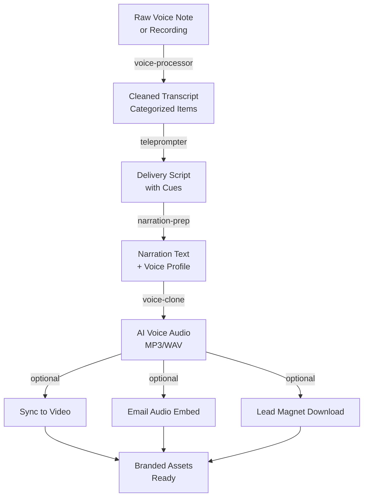

# Voice Cloning Pipeline

Create branded AI voice deliverables from raw audio. Useful for email teasers, video intros, lead magnet narrations, and accessibility-focused content.

## Overview

This workflow combines voice processing and teleprompter agents to:
1. Capture raw voice note or dictation
2. Clean and extract core insights
3. Prepare delivery-optimized script
4. Clone voice over content via ElevenLabs or Descript
5. Sync with video or deliver as audio asset

## Inputs

- Raw voice recording (MP3, WAV, or transcribed text)
- Desired output format (video intro, lead magnet narration, email teaser)
- Target duration (30 sec, 90 sec, 2-3 min)
- Voice tone preference (professional, conversational, energetic)

## Outputs

| Asset | Duration | Use | Format |
|-------|----------|-----|--------|
| Narration Script | 300-800 words | Voice cloning input | .txt with delivery cues |
| Voice Clone Audio | 30-180 sec | Standalone audio asset | MP3 / WAV |
| Video with VO | Per video spec | Branded video intro | MP4 with sync'd audio |
| Lead Magnet Narration | 2-3 min | Downloadable audio asset | MP3 |
| Email Teaser | 30-60 sec | Email embed or CTA link | MP3 |

## Pipeline (Step-by-Step)

### Step 1: Voice Processing (voice-processor agent)

**Input:** Raw voice note or recording transcript

**Process:**
1. Clean transcript: remove filler words (um, uh, like), fix transcription errors
2. Identify content types: thoughts, questions, instructions, action items
3. Categorize by priority and topic
4. Extract verbatim quotes and key phrases
5. Flag client references and time-sensitive items

**Output:**
- Cleaned, categorized transcript
- Prioritized action items
- Extracted verbatim quotes for social/email

**Time:** ~15-20 min

---

### Step 2: Teleprompter Script Generation (teleprompter agent)

**Input:** Cleaned transcript segment or raw notes

**Process:**
1. Convert to teleprompter-ready script format
2. Add delivery cues: pacing, emphasis, pauses
3. Mark ad-lib zones vs. verbatim lines
4. Include visual cues for syncing (if video component)
5. Adjust word count to match target duration

**Output:**
- Delivery script with markers
- Pacing map (word count per section)
- Visual direction notes (if video)

**Time:** ~15-25 min

---

### Step 3: Voice Clone Preparation

**Input:** Finalized teleprompter script

**Process:**
1. Convert to narration format (remove delivery cues, simplify language)
2. Remove URLs, timestamps, technical notation
3. Break into sections matching natural breath points
4. Adjust pacing for voice service (140-160 wpm target)
5. Add metadata: tone, accent, pacing preference

**Output:**
- Clean narration text (500-1500 words, depending on audio length)
- Voice profile specification (professional, warm, direct, etc.)
- Section markers for multi-part narration

**Time:** ~10-15 min

---

### Step 4: Voice Cloning & Synthesis

**Input:** Narration script and voice specification

**Process:** (Via ElevenLabs, Descript, or similar service)
1. Upload cleaned narration
2. Select or train voice model to match agent's tone
3. Generate audio file
4. Review for naturalness and pacing
5. Export as MP3/WAV

**Output:**
- AI-cloned voice audio file (MP3, WAV, or audio stream)
- Quality notes (any re-recording needed)

**Time:** ~5-15 min depending on service

---

### Step 5: Asset Integration (Optional)

**Input:** Voice audio file and target asset (video, email, landing page)

**Process:**
- **For video:** Sync audio with B-roll, add captions, insert graphics
- **For email:** Embed player or link to hosted audio
- **For lead magnet:** Create download page with voice narration

**Output:**
- Finalized video with AI voice-over
- Email with audio embed
- Downloadable audio file

**Time:** ~20-30 min (varies by asset type)

---

## Mermaid Workflow



## Example Invocation

```bash
# Step 1: Process raw voice note
ck run agent voice-processor \
  --input voice-note.mp3 \
  --output-format transcript

# Step 2: Generate teleprompter script
ck run agent teleprompter \
  --input cleaned-transcript.txt \
  --target-duration "1:30" \
  --purpose "email-teaser"

# Step 3: Prepare for voice cloning
cat teleprompter-script.txt | \
  sed 's/\[PAUSE.*\]//g' | \
  sed 's/\[EMPHASIS\]//g' > narration.txt

# Step 4: Send to ElevenLabs or Descript
curl -X POST https://api.elevenlabs.io/text-to-speech \
  --header "xi-api-key: $ELEVEN_API_KEY" \
  --data '{"text": "'"$(cat narration.txt)"'", "voice_id": "agent-voice-id"}'
```

## Best Practices

- **Voice training:** If using a voice clone, run 10-30 sample sentences first to train the model
- **Script length:** Keep narration under 2-3 minutes for email teasers, up to 5 min for lead magnets
- **Pacing:** Test at 140-160 wpm; adjust script length if audio sounds rushed
- **Natural breaks:** Insert section breaks every 30-45 seconds for email content
- **Accessibility:** Always provide transcript alongside voice content

## Cross-References

- [Voice Processor Agent](/agent-instructions/voice-processor) — Transcript cleaning & extraction
- [Teleprompter Agent](/agent-instructions/teleprompter) — Delivery script generation
- [Video-to-5-Assets Pipeline](/workflows/1-video-5-assets) — Uses voice cloning for teasers

## Integration Notes

- **Services:** ElevenLabs (fastest, ~30 voice options), Descript (built-in editing), Google Cloud TTS (lowest cost)
- **Quality:** Test voice clone on 30-second sample before committing to full narration
- **Costs:** Typically $10-50/month for unlimited voice synthesis depending on service tier
- **Turnaround:** Most services return audio within 5-15 minutes of submission

## Related Links

- [Teleprompter Agent Guide](/agent-instructions/teleprompter)
- [Voice Processor Agent Guide](/agent-instructions/voice-processor)
